# Glassware ERP System - Flowchart & Architecture Diagrams

This document contains visual flowcharts and diagrams representing the entire Glassware ERP system architecture, workflows, and data flow.

---

## 1. System Architecture Overview

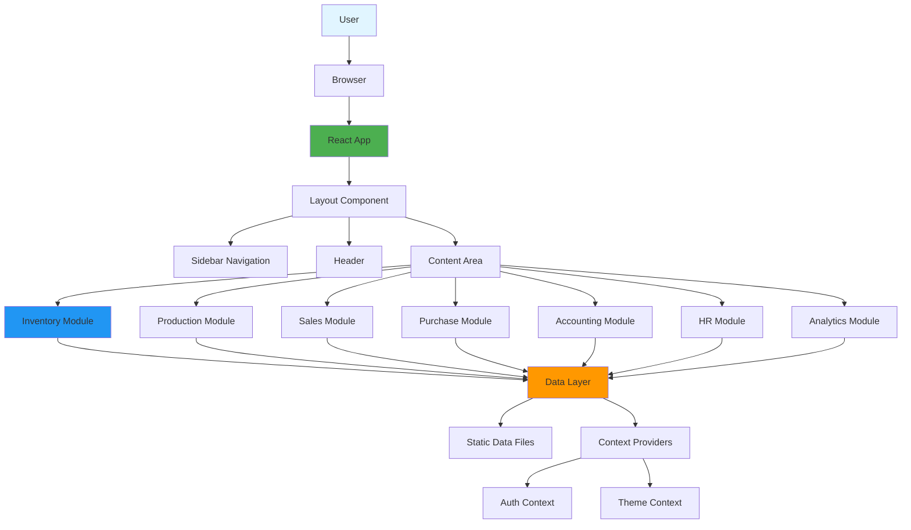

---

## 2. Inventory Module Flow

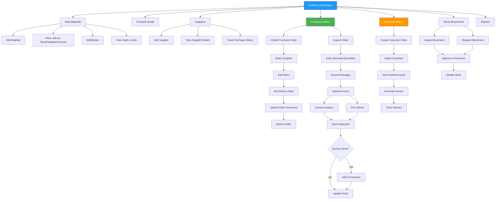

---

## 3. Purchase Order Workflow (Detailed)

```mermaid
flowchart TD
    Start([Start: Need Raw Materials]) --> CheckStock{Check Stock Levels}
    CheckStock -->|Low Stock| CreatePO[Create Purchase Order]
    CheckStock -->|Stock OK| End1([End])
    
    CreatePO --> SelectSupplier[Select Supplier]
    SelectSupplier --> AddItems[Add Items to Order]
    AddItems --> SetDates[Set Order & Delivery Dates]
    SetDates --> UploadDoc[Upload Order Document Optional]
    UploadDoc --> SubmitPO[Submit Purchase Order]
    SubmitPO --> POStatus[Status: Pending]
    
    POStatus --> WaitDelivery[Wait for Supplier Delivery]
    WaitDelivery --> ReceiveOrder[Order Received]
    ReceiveOrder --> Inspect[Open Inspection Modal]
    
    Inspect --> EnterReceived[Enter Received Quantities]
    EnterReceived --> CheckDamages{Any Damages?}
    CheckDamages -->|Yes| RecordDamages[Record Damaged Items]
    CheckDamages -->|No| UploadInvoice
    RecordDamages --> UploadInvoice[Upload Supplier Invoice]
    
    UploadInvoice --> ChooseMethod{Upload Method?}
    ChooseMethod -->|Camera| OpenCamera[Open Camera]
    ChooseMethod -->|File| SelectFile[Select File]
    
    OpenCamera --> CapturePhoto[Capture Photo]
    CapturePhoto --> ProcessImage[Convert to Base64]
    SelectFile --> ProcessFile[Read File as Base64]
    ProcessImage --> SaveInvoice
    ProcessFile --> SaveInvoice[Save Invoice File]
    
    SaveInvoice --> SaveInspection[Save Inspection]
    SaveInspection --> CheckExcess{Excess Items?}
    
    CheckExcess -->|Yes| ShowNotification[Show Excess Notification]
    CheckExcess -->|No| UpdateStock[Update Inventory Stock]
    
    ShowNotification --> ChooseAction{Action?}
    ChooseAction -->|Add to Existing| AddExisting[Add to Existing Material]
    ChooseAction -->|Create New| CreateNew[Create New Material Entry]
    
    AddExisting --> UpdateStock
    CreateNew --> UpdateStock
    UpdateStock --> UpdateStatus[Status: Completed]
    UpdateStatus --> End2([End: Stock Updated])
    
    style Start fill:#e1f5ff
    style CreatePO fill:#4CAF50,color:#fff
    style Inspect fill:#FF9800,color:#fff
    style UpdateStock fill:#2196F3,color:#fff
    style End2 fill:#e1f5ff
```

---

## 4. Low Stock Alert Flow

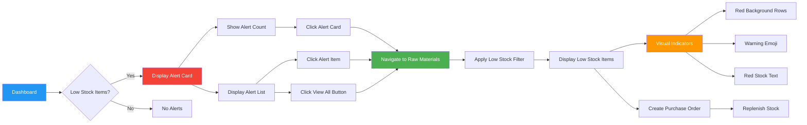

---

## 5. Data Flow Architecture

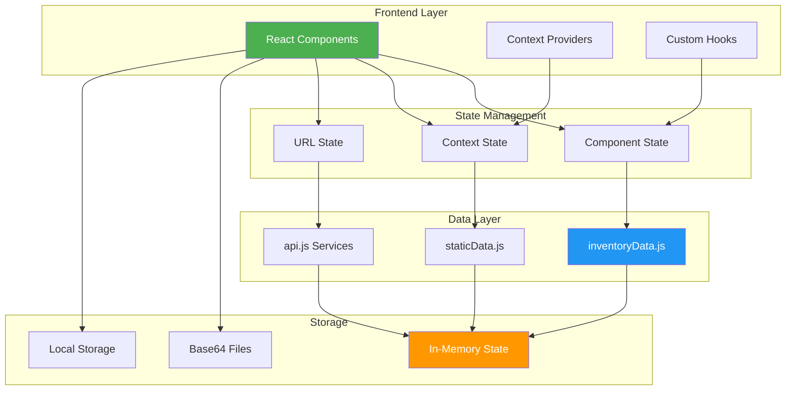

---

## 6. Module Interaction Flow

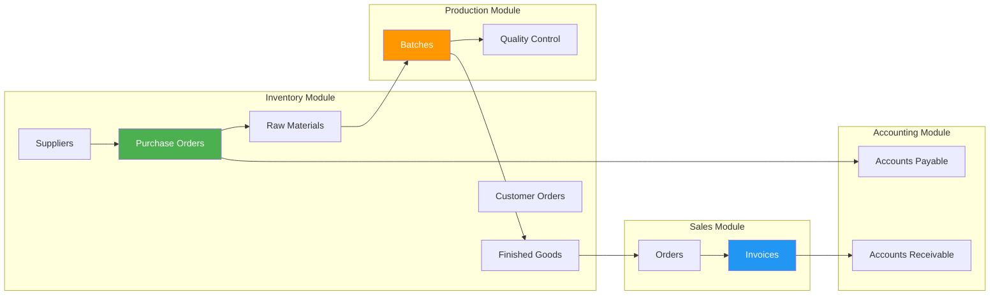

---

## 7. File Upload Flow (Camera & File)

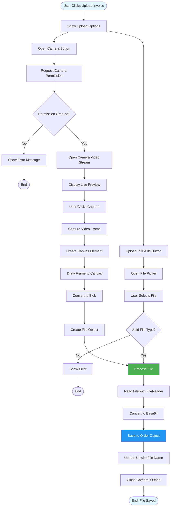

---

## 8. Filter System Flow

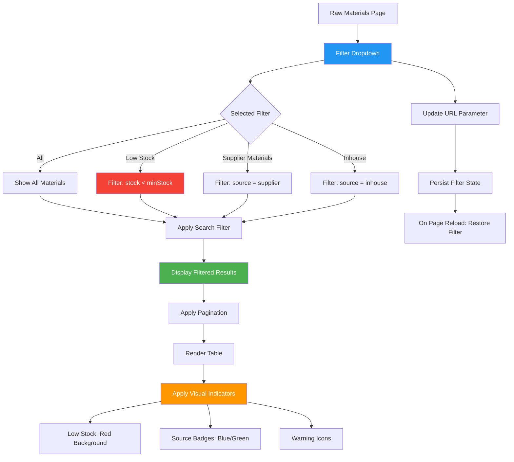

---

## 9. Complete User Journey Flow

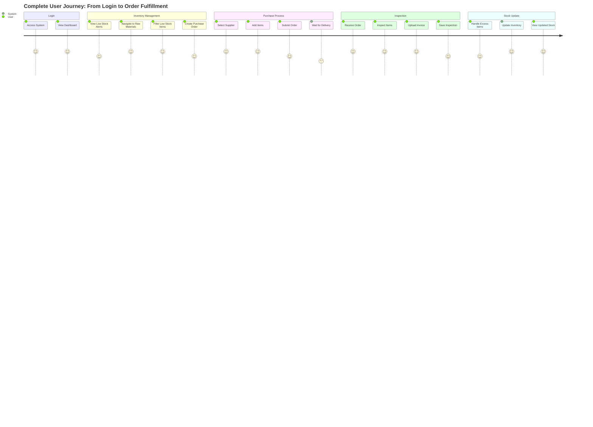

---

## 10. Component Hierarchy

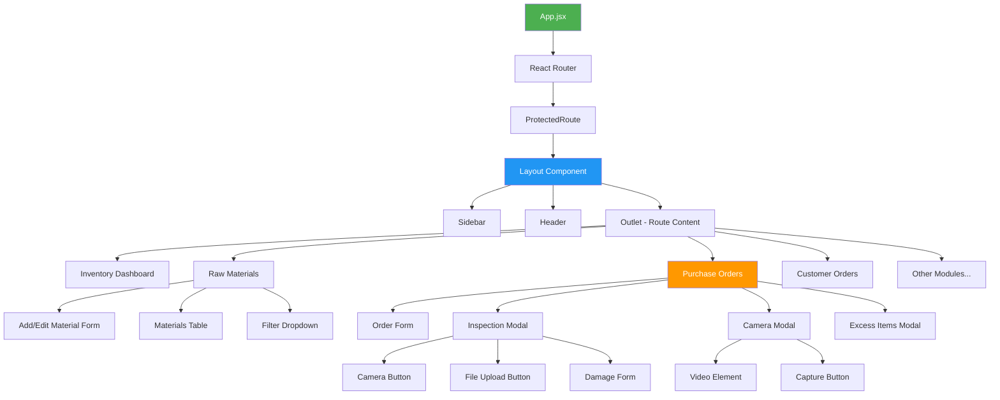

---

## 11. State Management Flow

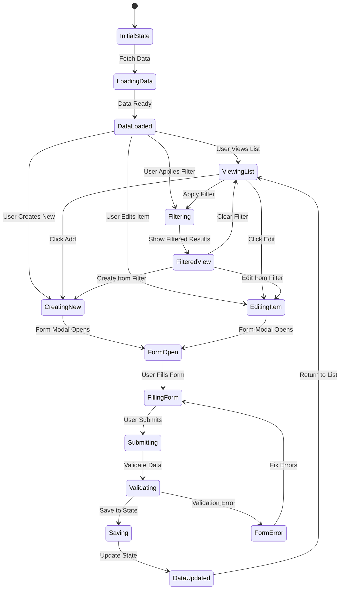

---

## 12. Technology Stack Visualization

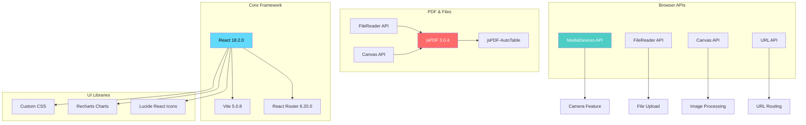

---

## How to Use These Diagrams

### Option 1: Mermaid Live Editor
1. Go to https://mermaid.live/
2. Copy any diagram code
3. Paste and view/export as PNG/SVG

### Option 2: VS Code Extension
1. Install "Markdown Preview Mermaid Support" extension
2. Open this file in VS Code
3. Preview to see rendered diagrams

### Option 3: GitHub/GitLab
- These diagrams render automatically in markdown files on GitHub/GitLab

### Option 4: Online Converters
- Use tools like:
  - https://mermaid.ink/
  - https://kroki.io/
  - Various Mermaid to image converters

---

## Diagram Descriptions

1. **System Architecture Overview**: High-level view of the entire system structure
2. **Inventory Module Flow**: Detailed flow of inventory management features
3. **Purchase Order Workflow**: Step-by-step purchase order process
4. **Low Stock Alert Flow**: How low stock alerts work and navigate
5. **Data Flow Architecture**: How data moves through the system
6. **Module Interaction Flow**: How different modules interact
7. **File Upload Flow**: Camera and file upload process
8. **Filter System Flow**: How filtering works in Raw Materials
9. **Complete User Journey**: User experience flow
10. **Component Hierarchy**: React component structure
11. **State Management Flow**: State transitions in the application
12. **Technology Stack Visualization**: Technologies used and their relationships

---

**Note**: All diagrams use Mermaid syntax which is widely supported. You can copy any diagram code and use it in documentation tools, presentations, or convert to images using online tools.

